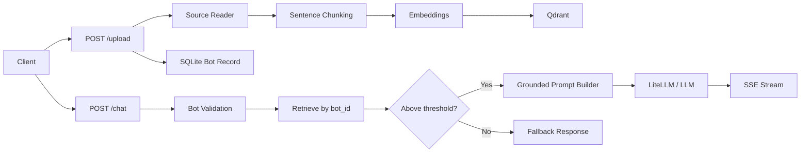

# EzeeChatBot

Multi-tenant RAG chatbot API for the Task E-1 assessment.

This service accepts a knowledge base upload for a single bot, chunks and indexes the content into Qdrant, and exposes a streaming `/chat` endpoint that only answers when retrieved evidence is strong enough. The implementation is intentionally simple, grounded, and production-lean: FastAPI for the API, Qdrant for vector storage, LlamaIndex for ingestion/index plumbing, LiteLLM for model access, and SQLite for bot usage stats.

## What This Project Does

- Accepts knowledge bases as plain text, URL content, base64 PDF, and multipart PDF file upload
- Creates an isolated `bot_id` per uploaded knowledge base
- Stores embeddings in Qdrant with bot-level filtering for multi-tenant isolation
- Retrieves only the most relevant chunks for a given bot
- Uses threshold-gated answering so the bot falls back instead of hallucinating
- Streams chat responses over Server-Sent Events (SSE)
- Tracks usage statistics such as message count, latency, unanswered questions, and estimated cost
- Supports text PDFs, scanned PDFs via OCR fallback, and optionally image-heavy pages via a vision fallback

## Assessment Alignment

This implementation is designed to match the skill assessment goals closely:

- Multi-tenant bot isolation is enforced at retrieval time through `bot_id` filters
- `/upload`, `/chat`, `/stats/{bot_id}`, and `/health` are implemented
- RAG responses are grounded in retrieved context rather than open-ended chat
- When evidence is weak, the system returns an explicit fallback instead of fabricating an answer
- Stats and observability are included to demonstrate real-world production thinking
- The stack stays practical instead of over-engineered

## Tech Stack

- API: FastAPI
- Retrieval/indexing: LlamaIndex
- Vector database: Qdrant
- LLM gateway: LiteLLM Proxy
- Models:
  - Generation: `gpt-4.1-mini` by default
  - Embeddings: `text-embedding-3-small` by default
- Metadata/stats store: SQLite
- Observability: Langfuse-compatible LiteLLM logging hooks
- Optional PDF OCR: `pytesseract` + local `tesseract` binary
- Optional visual page understanding: vision-capable LiteLLM/OpenAI-compatible model

## Repository Layout

- [app/main.py](/Users/ayushpatel/Documents/taska/ezeechatbot/app/main.py): FastAPI application startup and router wiring
- [app/routers/upload.py](/Users/ayushpatel/Documents/taska/ezeechatbot/app/routers/upload.py): knowledge base upload endpoint
- [app/routers/chat.py](/Users/ayushpatel/Documents/taska/ezeechatbot/app/routers/chat.py): streaming chat endpoint
- [app/routers/stats.py](/Users/ayushpatel/Documents/taska/ezeechatbot/app/routers/stats.py): usage metrics endpoint
- [app/services/pipeline.py](/Users/ayushpatel/Documents/taska/ezeechatbot/app/services/pipeline.py): ingestion pipeline and chunking
- [app/services/retriever.py](/Users/ayushpatel/Documents/taska/ezeechatbot/app/services/retriever.py): retrieval with threshold gating
- [app/services/chat_engine.py](/Users/ayushpatel/Documents/taska/ezeechatbot/app/services/chat_engine.py): grounded streaming generation
- [app/services/ingestion/pdf_reader.py](/Users/ayushpatel/Documents/taska/ezeechatbot/app/services/ingestion/pdf_reader.py): PDF text extraction, OCR fallback, and optional vision fallback
- [app/services/ingestion/vision_page_extractor.py](/Users/ayushpatel/Documents/taska/ezeechatbot/app/services/ingestion/vision_page_extractor.py): chart/formula/diagram page extraction
- [app/core/llama_settings.py](/Users/ayushpatel/Documents/taska/ezeechatbot/app/core/llama_settings.py): model and embedding configuration
- [app/core/qdrant_client.py](/Users/ayushpatel/Documents/taska/ezeechatbot/app/core/qdrant_client.py): Qdrant setup
- [tests/](/Users/ayushpatel/Documents/taska/ezeechatbot/tests): endpoint and ingestion tests

## End-to-End Flow



### 1. Upload

`POST /upload` accepts either:

- JSON payload for `text`, `website`, `pdf_url`, or `pdf_base64`
- multipart form-data for `pdf_file`

The API:

1. validates the input
2. reads the source into documents
3. injects `bot_id` metadata
4. chunks the content with a sentence-aware splitter
5. embeds and upserts the chunks into Qdrant
6. creates a stats record in SQLite
7. returns a `bot_id`

### 2. Retrieval

`POST /chat` first confirms the `bot_id` exists, then:

1. retrieves the top candidate chunks for that bot only
2. checks the top similarity against the answerability threshold
3. if the query is ungrounded, returns a fallback response
4. if the query is grounded, sends only the retrieved context into generation

This is intentionally a single retrieval pass. The earlier double-retrieval behavior was removed so retrieval and answer generation stay consistent.

### 3. Generation

The chat engine:

- lightly reranks retrieved nodes by score and text overlap
- formats them into labeled evidence blocks such as `[S1]`
- builds a constrained grounded prompt
- streams the answer over SSE
- includes usage metadata at the end of the stream

### 4. Stats

`GET /stats/{bot_id}` returns:

- total messages served
- average response latency
- estimated token cost
- unanswered question count
- answerable rate

## Chunking Strategy

### Default Strategy

The ingestion pipeline uses LlamaIndex `SentenceSplitter` with:

- `chunk_size=400`
- `chunk_overlap=50`

### Why Sentence-Based Chunking

This project keeps sentence-based chunking as the default because it is the best tradeoff for the assessment:

- it preserves complete thoughts better than naive fixed-size splitting
- it is much easier to explain to reviewers
- it keeps ingestion latency lower than heavier semantic chunking approaches
- it works well for policies, product docs, help pages, and FAQ-style content

### Why Not Recursive Chunking by Default

Recursive or hierarchical chunking can be strong for very large, highly structured corpora, but it adds implementation complexity faster than it improves reviewer-visible quality for this assignment. If this were expanded into a larger production system, a strong next step would be parent-child retrieval with citation-aware synthesis. For the assessment, sentence-aware chunking plus stronger grounding is the cleaner engineering decision.

### Source-Specific Handling

- Plain text: preserves the provided text with sentence-aware splitting
- URL: extracts readable text content and then chunks it
- PDF: extracts page text first, then merges OCR or vision output when needed before chunking

## PDF Handling

PDF ingestion now follows a 3-tier extraction strategy.

### 1. Native Text Extraction

Fastest path. Used for machine-readable PDFs where text can be extracted directly.

### 2. OCR Fallback

Used only when:

- OCR is enabled
- a page has very little extracted text
- the page has embedded images
- the page falls within configured OCR limits

This improves scanned or image-heavy text PDFs without forcing OCR across the whole file.

### 3. Vision Fallback

Optional and disabled by default. Used for pages that are likely to contain:

- charts
- graphs
- formulas
- diagrams
- image-first layouts

The page is rendered and passed to a multimodal model to extract a textual summary suitable for retrieval. This is meant to improve understanding of visual-heavy pages, not to guarantee perfect chart or mathematical interpretation.

### Latency Considerations

To avoid unnecessary upload slowdown:

- normal text PDFs stay on the fast path
- OCR only runs on pages that likely need it
- OCR page count is capped
- vision extraction is optional and capped
- vision is intended for exceptional pages, not the default path

## Grounding and Hallucination Control

The project prioritizes grounded behavior over answering every question.

Current safeguards:

- bot-scoped retrieval filters
- similarity threshold gating
- single-pass retrieval-to-generation flow
- explicit fallback when evidence is weak
- answer context assembled only from retrieved chunks
- source labels included in the prompt context

This is the main assessment value: the system is designed to refuse unsupported answers instead of sounding fluent but wrong.

## Configuration

Copy [`.env.example`](/Users/ayushpatel/Documents/taska/ezeechatbot/.env.example) to `.env`.

Important variables:

- `OPENAI_API_KEY`: API key for generation and embeddings
- `LLM_MODEL`: default generation model
- `EMBEDDING_MODEL`: embedding model
- `QDRANT_URL`: Qdrant connection string
- `LITELLM_PROXY_URL`: LiteLLM proxy base URL
- `SIMILARITY_THRESHOLD`: answerability threshold
- `MAX_CHUNK_TOKENS`: chunk size
- `OVERLAP_TOKENS`: chunk overlap
- `N_RETRIEVAL_RESULTS`: top-k retrieval count

PDF-related variables:

- `PDF_OCR_ENABLED`
- `PDF_OCR_MIN_IMAGE_COUNT`
- `PDF_OCR_RENDER_DPI`
- `PDF_OCR_MAX_PAGES`
- `PDF_OCR_MIN_TEXT_CHARS`
- `PDF_VISION_ENABLED`
- `PDF_VISION_MODEL`
- `PDF_VISION_RENDER_DPI`
- `PDF_VISION_MAX_PAGES`
- `PDF_VISION_MIN_IMAGE_COUNT`
- `PDF_VISION_MIN_TEXT_CHARS`
- `PDF_VISION_TIMEOUT_SEC`

## Local Setup

```bash
python -m venv venv
source venv/bin/activate
pip install -r requirements.txt
cp .env.example .env
```

If you want OCR support for scanned PDFs, install the `tesseract` binary too:

```bash
# macOS
brew install tesseract

# Ubuntu/Debian
sudo apt-get install tesseract-ocr
```

## Docker Setup

The recommended way to run the project is Docker.

```bash
docker compose up -d --build
```

The Docker image includes the `tesseract-ocr` system package, so OCR for scanned PDFs works inside the container after a rebuild. If you changed the Dockerfile or OCR settings, rebuild with `--build` instead of reusing an older image.

Services:

- API: `http://localhost:8000`
- Qdrant: `http://localhost:6333`
- LiteLLM Proxy: `http://localhost:4000`

Stop the stack:

```bash
docker compose down
```

## Streamlit UI

If you want a cleaner user interface than Swagger, a separate Streamlit app is included in [streamlit_app.py](/Users/ayushpatel/Documents/taska/ezeechatbot/streamlit_app.py).

Install the UI dependencies:

```bash
pip install -r requirements-streamlit.txt
```

Then run:

```bash
streamlit run streamlit_app.py
```

The Streamlit app lets users:

- upload plain text
- paste a website URL
- paste a direct PDF URL
- upload a PDF file
- chat with the returned `bot_id`
- inspect bot stats

## API Reference

### `POST /upload`

Creates a knowledge base and returns a `bot_id`.

Human-friendly request fields:

- `source_type`
- `text_content`
- `website_url`
- `pdf_url`
- `pdf_base64_content`
- `pdf_file`
- `metadata_json` for multipart metadata

Legacy `content_type` and `content` fields are still accepted for backward compatibility.

JSON examples:

```json
{
  "source_type": "text",
  "text_content": "Return requests must be made within 30 days."
}
```

```json
{
  "source_type": "website",
  "website_url": "https://example.com/help/refunds"
}
```

```json
{
  "source_type": "pdf_url",
  "pdf_url": "https://example.com/files/refund-policy.pdf"
}
```

```json
{
  "source_type": "pdf_base64",
  "pdf_base64_content": "<base64-pdf>"
}
```

Successful response example:

```json
{
  "bot_id": "8d16d7a2-0fc8-45ea-bf8c-cc7e4a8bb40e",
  "chunks_created": 3,
  "tokens_ingested": 214,
  "source_type": "text",
  "message": "Knowledge base ready. Use this bot_id to chat."
}
```

Validation error example:

```json
{
  "detail": "content is required for text type"
}
```

### `POST /chat`

Streams a grounded answer for the specified `bot_id`.

```json
{
  "bot_id": "your-bot-id",
  "user_message": "What is the refund policy?",
  "conversation_history": []
}
```

SSE stream example:

```text
data: {"delta":"The refund policy allows returns within 30 days ","finish_reason":null}

data: {"delta":"with proof of purchase. [S1]","finish_reason":null}

data: {"delta":"","finish_reason":"stop","input_tokens":214,"output_tokens":31,"cost_usd":0.00012,"latency_ms":842,"grounded":true}
```

Unanswerable stream example:

```text
data: {"delta":"I couldn't find enough information in the uploaded knowledge base to answer that reliably.","finish_reason":"stop","input_tokens":22,"output_tokens":16,"cost_usd":0.0,"latency_ms":44,"grounded":false}
```

### `GET /stats/{bot_id}`

Returns usage metrics for the bot.

Example response:

```json
{
  "bot_id": "8d16d7a2-0fc8-45ea-bf8c-cc7e4a8bb40e",
  "total_messages_served": 2,
  "average_response_latency_ms": 491.0,
  "estimated_token_cost_usd": 0.00017,
  "unanswered_questions": 1,
  "answerable_rate_pct": 50.0,
  "created_at": "2026-04-07T02:00:00Z",
  "last_active_at": "2026-04-07T02:01:30Z"
}
```

### `GET /health`

Checks API and dependency status.

Example response:

```json
{
  "api": "healthy",
  "qdrant": "healthy",
  "litellm_proxy": "healthy",
  "sqlite": "healthy"
}
```

## Testing

### Local

```bash
pytest -q
```

### Docker

```bash
docker compose up -d --build
bash test_integration.sh
docker compose run --rm -v "$PWD":/app api pytest -q
docker compose down
```

### Verified Status

The current repository was validated in Docker with:

- integration script passing
- full pytest suite passing (`19 passed`)

## Key Improvements Made During Review

The repository was strengthened in several important ways:

- `/upload` now supports JSON uploads correctly in addition to multipart uploads
- invalid upload inputs return cleaner client errors instead of being misreported as server errors
- the chat path no longer retrieves twice
- grounded prompt assembly now uses the retrieved nodes directly
- prompt cost accounting is more realistic
- OCR fallback was added for scanned/image-heavy PDFs
- optional vision extraction was added for graph/formula/diagram-heavy pages
- the logging layer was hardened so Docker startup does not fail on structured log fields
- containerized tests were repaired to match current `httpx` behavior

## Tradeoffs and What I Would Improve Next

If this project were extended further, the highest-ROI next improvements would be:

- a stronger citation formatter in the final streamed answer
- retrieval threshold calibration on a small evaluation set
- better HTML boilerplate stripping for some URL sources
- cross-encoder reranking before final generation
- structured source citation output per answer sentence

## Notes

- `LlamaIndex` is still part of the stack and is still used for ingestion, embeddings configuration, and vector index plumbing
- the chat path was simplified to keep grounding behavior explicit and consistent
- OCR improves scanned PDF handling, but mathematical formulas and chart understanding are still best-effort unless vision extraction is enabled
